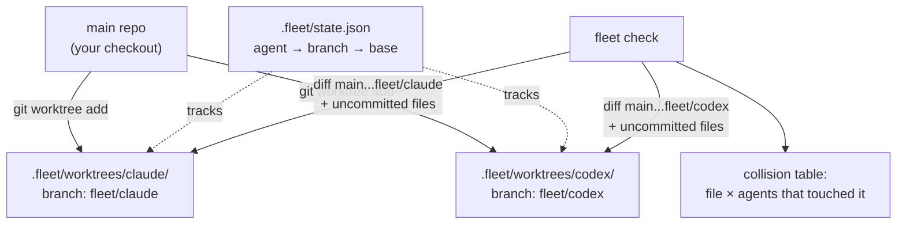

# Architecture

## The model: one worktree per agent

```
your-project/                        <- main repo, your own checkout (e.g. main)
├── .git/
│   └── info/exclude                 <- fleet adds ".fleet/" here on first spawn
├── .fleet/                          <- never committed, lives only on disk
│   ├── state.json                   <- coordination layer (source of truth)
│   └── worktrees/
│       ├── claude/                  <- full checkout of branch fleet/claude
│       └── codex/                   <- full checkout of branch fleet/codex
└── src/ ...                         <- your files, untouched by any agent
```


```mermaid
graph TD
    R["main repo<br/>(your checkout)"] -- "git worktree add" --> A[".fleet/worktrees/claude/<br/>branch: fleet/claude"]
    R -- "git worktree add" --> B[".fleet/worktrees/codex/<br/>branch: fleet/codex"]
    S[".fleet/state.json<br/>agent → branch → base"] -. tracks .-> A
    S -. tracks .-> B
    C["fleet check"] -- "diff main...fleet/claude<br/>+ uncommitted files" --> A
    C -- "diff main...fleet/codex<br/>+ uncommitted files" --> B
    C --> O["collision table:<br/>file × agents that touched it"]
```

`fleet spawn <name>` runs `git worktree add .fleet/worktrees/<name> -b fleet/<name> <base>`, records the mapping in `state.json`, then provisions the worktree (`copyOnSpawn` files first, `postSpawn` hook second, so the hook can rely on the copied files). `fleet check` walks every recorded agent, collects the files each one changed (`git diff --name-only <base>...<branch>` for committed work, `git status --porcelain` in the worktree for uncommitted work), and reports any file that appears under more than one agent. `fleet merge` runs that same check first, refuses while the target agent collides with another active agent, runs the `preMerge` hook, merges into the main worktree's current branch, and aborts cleanly (`git merge --abort`) on conflict — the repo is never left mid-merge. `fleet sync` is the same abort-on-conflict merge in the other direction: base into agent branch, run inside the agent's worktree. `fleet sync --all` runs that catch-up across every registered agent under one lock, isolating per-agent failures — a dirty worktree or conflicting merge is reported and skipped so it never strands the rest of the fleet.

`fleet exec <agent> -- <cmd>` re-joins the argv into one shell command (`src/lib/proc.ts` `shellJoin`, a pragmatic quoting heuristic for sh and cmd.exe) and runs it with the worktree as cwd; `--all` fans out sequentially so output never interleaves. `fleet pr` never bundles GitHub logic: it verifies the `gh` binary exists (before pushing anything), pushes the branch to `origin`, and shells out to `gh pr create`.

### Refinements: line ranges and merge simulation

File-level overlap stays the default signal, but `--lines` refines it: for each agent, one `git diff -U0 <merge-base>` inside the worktree yields the edited line ranges of committed *and* uncommitted work at once, in old-side (merge-base) coordinates — the only coordinate system two agents' diffs share. Ranges are intersected per file across agents; files whose edits are disjoint are reported informationally instead of counting as collisions (and don't affect the exit code). Untracked and binary files have no line info and stay whole-file collisions. Caveat: when two agents were spawned from different bases their merge bases differ, so cross-agent line numbers are a heuristic, not a guarantee — which is why `--lines` is opt-in.

On git >= 2.38 `fleet check` adds a stronger layer by default: for every pair
of agents sharing a file it runs `git merge-tree --write-tree` — a real
in-memory three-way merge over the shared object database, touching no
worktree or index. Shared files then carry a verdict: **will conflict**
(simulation found conflict markers), **uncommitted edits** (a sharer has
uncommitted changes there, or a branch is missing — simulation can't see
those, so they fail closed), or clean (committed sides auto-merge; reported
informationally, exit 0). `fleet merge`'s gate filters `check`'s collisions,
so it inherits these semantics: provably clean overlaps stop blocking merges,
while predicted conflicts and uncommitted overlaps still refuse. A wrong
"clean" verdict is caught by the merge's own abort-on-conflict safety net —
prediction sharpens the signal; the safety guarantee never rested on it.
`--files-only` opts out; git < 2.38 falls back automatically (`fleet doctor`
reports which mode you get).

`list`, `status`, `check`, and `doctor` accept `--json` and print their result object verbatim — the same data the human output renders, for scripts, CI gates, and the agents themselves. `fleet dashboard` composes those same pure collectors — the listing table, per-agent touched-file counts from `check`, a validation tally, and the collision report — into one frame, re-rendered live like `watch` (chained timeouts, so a slow frame can never overlap the next) or printed once with `--once`.

Switchyard needs git >= 2.31 (`rev-parse --path-format=absolute`, used to resolve the main repo root from inside any worktree); `fleet doctor` verifies this.

## Why worktrees, not just branches

Branches alone don't isolate anything — they share one working directory and one index. The incident that motivated this project was exactly that failure mode: two agents on one checkout, one ran `git reset` mid-merge while the other was editing the same files, and the merge state silently vanished.

Worktrees give each agent a **real, separate directory on disk** with its own checked-out files, its own index, and its own HEAD. A `git reset`, `git checkout`, or half-finished merge inside `.fleet/worktrees/codex/` physically cannot disturb the files in `.fleet/worktrees/claude/` or in your main checkout. The only shared surface is the object database and refs — which is precisely what makes `fleet check` cheap: all branches are visible from the main repo without fetching or copying anything.

Switchyard also writes `.fleet/` into `.git/info/exclude` (not `.gitignore`) on first spawn, so it never needs to modify — or dirty — the repository it manages.

## State file schema

`.fleet/state.json` is the source of truth for every command:

```json
{
  "version": 1,
  "agents": {
    "claude": {
      "name": "claude",
      "branch": "fleet/claude",
      "baseBranch": "main",
      "worktreePath": ".fleet/worktrees/claude",
      "createdAt": "2026-07-16T09:30:00.000Z"
    }
  }
}
```

- `version` — schema version, bump on breaking changes to this file.
- `branch` — always `fleet/<name>`; the prefix is what makes `fleet clean` safe to scope.
- `baseBranch` — the branch the agent was spawned from; the default base for `fleet diff`, the merge target checked by `fleet clean`, and the comparison point for ahead/behind counts.
- `worktreePath` — relative to the repo root, forward slashes, so the state file survives the repo being moved or shared across OSes.
- `validation` — optional: the last `fleet validate` outcome, as
  `{ commit, ok, at, command }`. Staleness is deliberately not stored:
  readers compare `commit` against the live branch tip and `command` against
  the configured command, so the record can never claim more than "this exact
  commit got this exact result". Doctor rebuilds drop it — it is re-derivable
  by re-running `fleet validate`.
- `prBranch` — optional: the public branch name `fleet pr` last published this
  agent as. The head ref is visible in the PR header, so it is task-derived
  rather than `fleet/<agent>`; recording it keeps re-runs updating the same
  remote ref instead of minting a new one per run.

Writes go through a write-then-rename (`state.json.tmp` → `state.json`) in `src/lib/state.ts`, so a crash mid-write can't corrupt the file. Commands tolerate drift between state and reality (a manually deleted worktree shows as `worktree missing` in `fleet list`; a manually deleted branch becomes a `fleet clean` candidate) rather than crashing — and `fleet doctor --fix` actively repairs drift: it rebuilds a corrupted `state.json` from real `git worktree list` output, adopts orphaned worktrees back into state, removes leftover non-worktree directories under `.fleet/worktrees/`, and prunes entries whose worktree is gone (branches are never deleted by doctor). Rebuilt entries carry re-derived `baseBranch`/`createdAt` values, not the originals.

Persisted agent identity is treated as a safety boundary, not trusted as an
arbitrary filesystem location or branch. Every record must resolve to the
direct child `.fleet/worktrees/<agent>` (including through symlinks and Windows
junctions), its branch must be exactly `fleet/<agent>`, and the state key,
record name, directory name, and branch suffix must agree. An escaping or
lookalike path such as `.fleet/worktrees-old/alice`, or a redirected branch,
makes the state corrupted; mutating commands refuse before touching Git, and
`fleet doctor --fix` rebuilds state only from registered `fleet/*` worktrees
inside the managed directory. The same checks are applied to an undo record
before `reset --hard` runs.

## Mutation lock

Every mutating command (`spawn`, `merge`, `remove`, `clean`, `sync`,
`validate`, `doctor --fix`, `undo`) runs under `.fleet/lock` — an atomically created file
holding the holder's PID, command, and start time (`src/lib/lock.ts`). This
serializes read→modify→write cycles on `state.json` across processes, which
matters because agents themselves run `fleet` commands concurrently. Waiters
retry for up to 10 s, then fail naming the holder. A lock whose PID is dead is
taken over automatically; `fleet doctor` reports lock state and `--fix`
removes dead locks. Read-only commands and `fleet exec` never take the lock
(exec runs long agent workloads). The lock is same-machine only — consistent
with state being local by design — and reentrant within one process
(merge → autoClean → clean). In-process parallel mutation remains unsupported.

## Validation gate

With a `validate` command in `.fleetrc.json`, "the tests pass" becomes
recorded state instead of a convention. `fleet validate <agent>` runs the
command inside the worktree and writes the outcome onto the agent's state
entry, pinned to the branch tip; `--all` sweeps the fleet with the same
per-agent failure isolation as `sync --all`. The worktree must be clean both
before and after the command: a command that leaves uncommitted content cannot
certify a commit, regardless of its exit code, so no result is recorded. A
command that commits its changes and leaves the worktree clean is supported;
the tip is re-resolved after the run and that new commit is recorded.

`fleet merge` consumes the record rather than duplicating the run: a passing
record at the tip for the currently configured command is trusted and the
command is not re-run; a failing record at the tip refuses immediately — same
commit, same command, same answer; a missing or stale record is run and
recorded on the spot. `preMerge` is unrelated and still runs at merge time:
`validate` is the recorded, skippable gate, `preMerge` the always-run hook.
The distinction is what lets an agent (or CI) make the fleet green *before*
merge time without merge losing any protection.

## Undo model

`fleet merge` records its pre-merge world before touching anything: two refs —
`refs/fleet/undo-head` (target branch HEAD) and `refs/fleet/undo-branch`
(agent branch tip) — pin the commits against GC even after the branch is
deleted. Immediately after Git succeeds — before worktree removal, branch
deletion, or state writes — `.fleet/undo.json` stores the agent record, target
branch, and post-merge HEAD. Cleanup finalizes its historical flags, but undo
inspects live branch/worktree state so even the provisional record recovers an
interrupted cleanup. A failed or aborted Git merge deletes the refs and writes
no record, so `fleet undo` can never act on a failed merge. Undo refuses unless
the current branch, HEAD, and refs all match the record and the main worktree
has no tracked changes; then it hard-resets the target branch, recreates any
missing agent branch/worktree, restores the state entry, and clears the record.
Single-level by design: any new merge overwrites the slot. `fleet doctor`
reports a pending record.

## MCP surface

`fleet mcp` (`src/commands/mcp.ts`) serves four read-only tools —
`fleet_list`, `fleet_status`, `fleet_check`, `fleet_lock_status` — over MCP's
stdio transport, so the agents themselves can read fleet state. Three
constraints shaped the implementation.

**stdout is the protocol channel.** Any stray write corrupts the JSON-RPC
stream and kills the client session. The command functions compute *and* print,
so they cannot be called from a tool handler; the tools call the pure
collectors instead (`collectListings`, `collectStatus`, `collectCheck`, plus
`lockStatus`, which never printed). That separation — data-gathering split from
rendering, mirroring `collectListings`/`buildListTable` — is the mechanism.
Rerouting `console` to stderr is layered on top as a net for anything that
writes without going through them, not as the mechanism itself.

**Requests are handled strictly one at a time** (`src/lib/jsonrpc.ts`). No v0.3
tool mutates anything, so the process-global reentrancy counter in
`withLock` cannot be re-entered today; the subprocess test asserts the server
never creates `.fleet/lock` at all. Serialization is forward-protection: the
guarantee is cheaper to build in now than to retrofit into a server written
assuming concurrency. `lock.ts` is unmodified.

**State is re-read on every call.** The server is long-lived while agents spawn
and merge underneath it, so any caching would serve stale answers; a test
spawns an agent through the CLI mid-session and asserts it appears.

The protocol layer (`src/lib/mcp.ts`) is transport-agnostic and targets
revision `2025-11-25`, verified against the published spec rather than assumed
— notably that stdio framing is newline-delimited JSON, not `Content-Length`
headers, and that an unsupported version is a negotiation rather than an error.
Tool payloads are JSON-stringified into a text content block. The spec's
`structuredContent` is declined because it must be a JSON *object* while
`fleet_list` returns an array: honoring it would mean either wrapping that one
result in a new envelope or making one tool answer unlike the other three.

Errors split along whether a model could recover: an unknown tool is a JSON-RPC
error (no retry fixes it), while every execution failure is an `isError` result
carrying the `FleetError` message, which is already written to be acted on.
Unexpected failures land there too, deliberately — a branch deleted or worktree
removed in another terminal must not take down the calling agent's session.

No mutating tool is exposed, which also means the `postSpawn` hook is not
reachable from an agent. Adding `fleet_spawn` later reopens that trust boundary
and would need saying so.

## Onboarding: `fleet init`

Every guarantee above is reachable only if the agents in the repo know the
convention exists. Before `fleet init` that knowledge travelled by manual file
copy, which meant it usually did not travel at all: the MCP tools report state
but cannot convey that checking belongs *before* the edit, and an agent that
finds no spawn tool and was never told why falls back to raw `git worktree add`
— the exact untracked state Switchyard exists to prevent.

`fleet init` (`src/commands/init.ts`) writes four things, in this order:

1. `.fleet/` into `.git/info/exclude`, so a repo that has never spawned still
   ignores the directory.
2. A starter `.fleetrc.json` carrying only `$schema`, which is what makes every
   valid key discoverable through editor autocomplete.
3. `.claude/skills/switchyard/SKILL.md`, copied from the packaged skill.
4. A protocol block in `AGENTS.md`, created if the file is absent.

**Two artifacts, not one generated from the other.** A skill loaded on demand
can afford a hundred lines; a file every agent reads up front cannot. Rendering
a summary out of the skill automatically produces a worse block than writing the
short version directly, so `AGENTS_BLOCK` in `src/lib/protocol.ts` is maintained
as its own text — a TypeScript constant rather than a shipped file, so it needs
no `files` entry and has no runtime resolution failure mode. The skill *is* read
from disk, because Claude Code requires it as a file at a fixed path anyway.

**What init overwrites is split on ownership.** `.fleetrc.json` is the user's
file and is never replaced without `--force`. The skill and the `AGENTS.md`
block are package-managed content, refreshed on every run — a stale convention
is the failure this command exists to fix, so re-running after an upgrade is the
intended way to stay current.

Idempotence rests on the `<!-- switchyard:begin -->` / `<!-- switchyard:end -->`
markers: `upsertMarkedBlock` (pure, so the placement rules test without a
filesystem) replaces the marked region when the pair is present and appends when
it is not. A half-present or inverted pair is a hard error rather than a guess,
because guessing where the user's content ends risks eating it. Files are
written only when the content would actually change, so a second `init` reports
`unchanged` and touches no mtimes.

Init takes the mutation lock even though it never reads or writes
`state.json` — two concurrent runs would otherwise interleave their
read-modify-write of `AGENTS.md` and could duplicate the block.

`fleet init --check` verifies the same four artifacts without writing any of
them — read-only and lock-free, exit 1 on drift — so CI can enforce what init
installs. `.fleetrc.json` follows the ownership split here too: it is the
user's file, so only its absence counts as drift, never its content. Broken
`AGENTS.md` markers, which init refuses to touch, are reported as `broken`
rather than thrown so the rest of the report still lands.

## Config file

An optional `.fleetrc.json` at the repo root (committed or not — the user's choice) provides per-repo defaults, read by `src/lib/config.ts`:

```json
{
  "defaultBase": "main",
  "watchInterval": 3,
  "autoClean": false,
  "copyOnSpawn": [".env"],
  "postSpawn": "npm ci",
  "preMerge": "npm test"
}
```

| Key | Type | Used by | Built-in default |
| --- | --- | --- | --- |
| `defaultBase` | string | `fleet spawn` base when `--from` is absent | current branch |
| `watchInterval` | number (seconds) | `fleet watch` refresh rate | 3 |
| `autoClean` | boolean | run a `fleet clean` sweep after each successful `fleet merge` | false |
| `copyOnSpawn` | string[] (repo-root-relative) | `fleet spawn` copies these into every new worktree (gitignored essentials: `.env`, local config). Absolute paths and `..` segments are rejected at parse time | none |
| `postSpawn` | string (shell command) | `fleet spawn` runs it inside the new worktree after copying. Failure is reported, worktree kept | none |
| `preMerge` | string (shell command) | `fleet merge` runs it inside the agent's worktree after the collision gate; non-zero exit aborts before the merge starts | none |

Precedence is always CLI flag > `.fleetrc.json` > built-in default. Unknown keys and wrong types are hard errors (typo protection), a missing file is not. Note the distinction around merge cleanup: removing the merged agent itself is `fleet merge`'s default behavior (opt out per-invocation with `--no-clean`); `autoClean` only controls the *additional* sweep of other fully merged agents.

## Current limitations

- **Single-repo scope.** State lives per-repository; there is no cross-repo view of agents.
- **No submodule support.** Worktrees of repos with submodules are untested and likely broken; don't rely on them.
- **No remote/multi-machine coordination.** `state.json` is local disk only — two machines managing the same clone don't see each other's agents. Nothing syncs, nothing locks.
- **Collision detection is file-level by default.** Two agents editing disjoint parts of one file is still flagged — deliberately, since file-level overlap is where merge pain starts. `fleet check --lines` opts into line-range intersection, with the merge-base caveat described above.
- **The MCP surface is read-only.** Agents can observe the fleet but not join it: there is no tool to spawn, merge, remove, or clean. If early use shows agents ignoring the tools because they cannot act on what they see, that is the signal to promote `fleet_spawn` — a contained change, and one far easier to widen than to narrow once agents depend on it.
- **`clean --stale` judges idleness by the branch's last commit date.** Uncommitted-but-untouched-for-weeks worktrees are protected by the dirty check instead (never removed), since file mtimes are too easy to disturb to trust for deletion.
